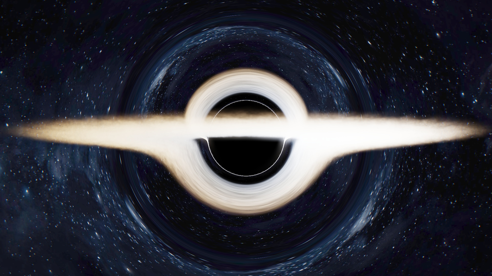

# Sagittarius: A Cinematic Black Hole Renderer in NVIDIA Warp

<p align="center">
  <!-- <a href="https://www.youtube.com/watch" target="_blank"> -->
    
  <!-- </a> -->
</p>

A cinematic renderer for a gravitationally-lensed black hole, inspired by the movie *Interstellar*. This project is a ground-up rewrite of [Gargantua](https://github.com/amirh0ss3in/Gargantua), migrated from [Taichi](https://www.taichi-lang.org/) to [NVIDIA Warp](https://github.com/NVIDIA/warp) for more direct CUDA control and a cleaner kernel architecture.

It combines a general relativistic ray tracer with a dynamic, volumetric 3D fluid simulation for the accretion disk, and a multi-pass post-processing pipeline to create a scientifically-grounded cinematic render.

## Features

- **General Relativistic Ray Tracing:** Simulates the path of light through the curved spacetime of a Schwarzschild black hole using a **Dormand-Prince 5(4) adaptive integrator**, accurately producing gravitational lensing and the iconic photon ring halo.
- **Dynamic 3D Accretion Disk on a Cylindrical Grid:** The accretion disk is a full 3D gas volume simulated in real-time on a custom **cylindrical coordinate grid (radius, theta, height)**, naturally aligned with the disk geometry for maximum resolution where it matters.
- **BFECC Fluid Advection:** The fluid simulation uses **Back and Forth Error Compensation and Correction (BFECC)** for both scalar density and velocity fields, significantly reducing numerical diffusion compared to a standard semi-Lagrangian scheme and producing sharper, more detailed gas filaments.
- **Pre-Baked Noise Field:** High-frequency structural FBM noise is evaluated once at startup via `bake_noise_kernel` and stored in VRAM. Ray marching lookups replace costly per-pixel per-step FBM evaluations with a single grid sample, substantially reducing render time.
- **Volumetric Rendering:** The accretion disk is rendered as a true volume, with emission and absorption integrated along each segment of the lensed ray path.
- **Advanced Lighting & Shading:**
  - **Relativistic Doppler Beaming:** Doppler shift and relativistic beaming are computed against the *bent* photon geodesic direction, not the original ray, producing physically accurate brightening on the approaching side of the disk.
  - **Blackbody Radiation:** Disk temperature is mapped radially from ~2000 K at the outer edge to ~12000 K near the ISCO, and further Doppler-shifted per sample. The `blackbody()` function maps temperature to an RGB color via Planckian approximations.
  - **Equatorial Shadow Band:** A soft self-shadowing term darkens the disk midplane, lending it the characteristic dark lane seen in *Interstellar*.
- **Multi-Pass Cinematic Post-Processing:**
  - Separable Gaussian bloom (horizontal + vertical blur passes) extracted from a bright-pass threshold.
  - Chromatic aberration via per-channel lateral pixel offset, scaled by radial screen distance.
  - ACES tone mapping for film-like color grading.
  - Gamma correction (sRGB, γ = 2.2).
  - Vignette.
- **Intelligent Frame Caching:** Avoids re-rendering identical frames by hashing all simulation and camera parameters. Cached frames are saved to disk and reloaded instantly, ideal for iterating on camera paths without re-running the full simulation.
- **Rich Terminal Output:** Color-coded progress bars, per-frame timing, cache hit/miss counters, and live CPU/RAM monitoring via `rich` and `psutil`.
- **GPU-Accelerated:** All simulation and rendering kernels are compiled to CUDA by the Warp JIT compiler.

## Technical Deep Dive

The renderer's core is a ray tracer that solves the geodesic equations of light in curved Schwarzschild spacetime. Instead of tracing straight lines, the **Dormand-Prince 5(4)** integrator in `dopri5_step` adaptively steps each photon along its curved geodesic, with the step size controlled by an error estimate between the 4th- and 5th-order solutions. This allows large steps in flat regions and tiny steps near the horizon where curvature is extreme.

The accretion disk is a **3D Eulerian fluid simulation** running on a cylindrical grid (r, θ, y). At each frame, `simulation_step` applies **BFECC advection** — a forward advect, a backward advect to estimate the error, and a corrected forward advect — for both the density and velocity fields. This three-pass scheme largely cancels the first-order dissipation error of simple semi-Lagrangian advection, preserving sharp filament structures over many frames. Keplerian orbital forces and a gravity correction term are applied afterward via `apply_forces`.

The noise texture that carves cloud structure into the disk is baked once into a `(grid_r, grid_theta, grid_y)` Warp array by `bake_noise_kernel` at startup. During ray marching, `sample_world_density` looks this up with trilinear interpolation — replacing five octaves of inline FBM per sample with a single array read.

Post-processing is a dedicated five-kernel pipeline: `extract_bright_kernel` thresholds the HDR buffer; `blur_h_kernel` and `blur_v_kernel` apply a separable Gaussian over a 24-pixel radius; `composite_kernel` adds the bloom at 0.4× weight, applies a radially-scaled chromatic aberration offset, multiplies by a vignette, and feeds the result through ACES tone mapping and gamma correction.

## Differences from Gargantua

| Feature | Gargantua (Taichi) | Sagittarius (Warp) |
| :--- | :--- | :--- |
| GPU backend | Taichi | NVIDIA Warp |
| Fluid advection | Semi-Lagrangian | BFECC |
| Noise evaluation | Per-pixel FBM at runtime | Pre-baked to VRAM grid |
| Bloom | Inline single-pass | Separable Gaussian multi-pass |
| Chromatic aberration | — | Per-channel lateral offset |
| Doppler direction | Original ray | Bent geodesic direction |
| Suns / point lights | Two procedural suns, HG scattering | Removed (disk self-emission only) |
| Film grain | Yes | Removed |
| Anamorphic flares | Yes | Removed |
| Dependencies | taichi, tqdm, pynvml, ... | warp-lang, opencv, numpy, rich, psutil |

## Installation

```bash
pip install warp-lang numpy opencv-python rich psutil
```

A CUDA-capable NVIDIA GPU is required.

## Usage

Configure the render settings at the top of `camera_controller.py`:

```python
SHOW_GUI              = False
SAVE_VIDEO            = True
VIDEO_DURATION_SECONDS = 40
VIDEO_FPS             = 30
OUTPUT_FILENAME       = "sagittarius_flight.mp4"
RENDER_WIDTH          = 1920
```

Then run:

```bash
python camera_controller.py
```

Rendered frames are cached under `frame_cache/<config_hash>/`. Delete this directory to force a full re-render.

## Camera Path

The default animation in `camera_controller.py` orbits the black hole with a 200-second period while easing the camera from r = 45 to r = 20 over 60 seconds, dropping the viewing angle to ~5.7° above the disk plane. This grazing angle forces photons to bend sharply to reach the camera, producing the characteristic *Interstellar* halo over the event horizon.

## Future Work

| Optimization | Benefit |
| :--- | :--- |
| **Pressure projection / divergence-free velocity** | The current solver does not enforce incompressibility. Adding a Jacobi or Conjugate Gradient pressure projection step would produce more physically correct swirling flow. |
| **Kerr metric** | Extending the geodesic integrator to Kerr spacetime (Boyer-Lindquist coordinates) would add frame dragging and ergosphere effects. |
| **Sparse grid** | A significant fraction of the cylindrical grid is empty. A sparse data structure would reduce memory and compute proportionally. |
| **Adaptive ray sampling** | Importance-sampling the step size based on local density (in addition to curvature) would concentrate ray marching work inside the disk where it matters. |

<!-- ## Star History

<a href="https://www.star-history.com/#amirh0ss3in/Sagittarius&Date">
 <picture>
   <source media="(prefers-color-scheme: dark)" srcset="https://api.star-history.com/svg?repos=amirh0ss3in/Sagittarius&type=Date&theme=dark" />
   <source media="(prefers-color-scheme: light)" srcset="https://api.star-history.com/svg?repos=amirh0ss3in/Sagittarius&type=Date" />
   
 </picture>
</a> -->